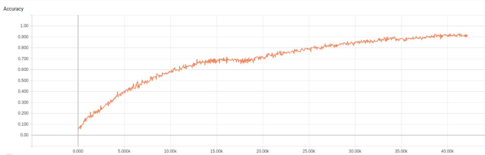
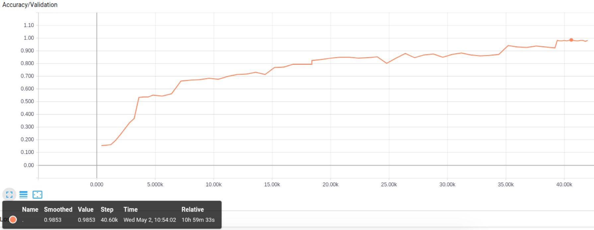
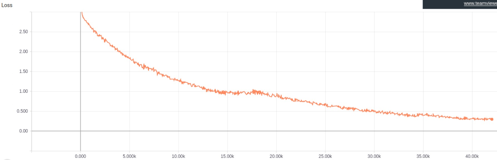
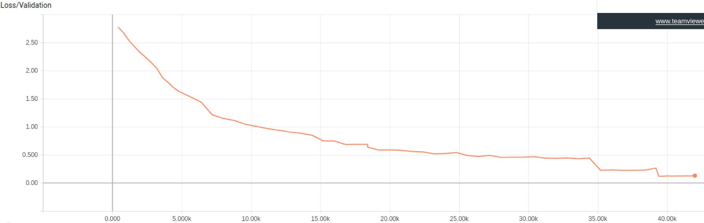

# Author: 1701214013 王尧
## 0. Result visualization

- #### Accuracy on training set(converged around 0.92)



- #### Accuracy on validation set(converged around 0.98, peak: 0.9853)



- #### Loss on training set



- #### Loss on validation set



## 1. Network structure

I implemented alexnet on tensorflow, using tflearn toolkits.

- #### The building of Alexnet is sequential:

```
network = input_data(shape=[None, 227, 227, 3])
network = conv_2d(network, 96, 11, strides=4, activation='relu')
network = max_pool_2d(network, 3, strides=2)
network = local_response_normalization(network)
network = conv_2d(network, 256, 5, activation='relu')
network = max_pool_2d(network, 3, strides=2)
network = local_response_normalization(network)
network = conv_2d(network, 384, 3, activation='relu')
network = conv_2d(network, 384, 3, activation='relu')
network = conv_2d(network, 256, 3, activation='relu')
network = max_pool_2d(network, 3, strides=2)
network = local_response_normalization(network)
network = fully_connected(network, 4096, activation='tanh')
network = dropout(network, 0.2)
network = fully_connected(network, 4096, activation='tanh')
network = dropout(network, 0.2)
network = fully_connected(network, 17, activation='softmax')
```

- #### Here's hyperparameters of my Network.

|hyperparameters|     value     |
|---------------|---------------|
| learning_rate | 1e-3 ->> 2e-4 |
| optimizer     |  SGD          |
| n_step        |  41800        |
| batch_size    |  64           |
| dropout_rate  |  0.2          |

## 2. Result analysis
- The SGD optimizer needs a big learning_rate like 1e-3. It is tend to stuck in local minimum when I set the learning_rate = 1e-5.
- Total epoch number = n_step * batch_size / dataset_sum = 41800 * 64 / 1360 = 1967. For momentum, we could see that SGD needs a way
