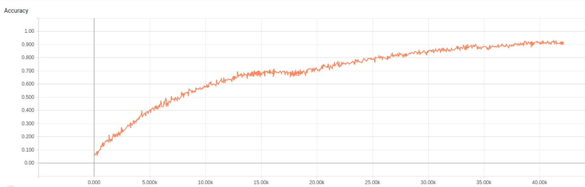
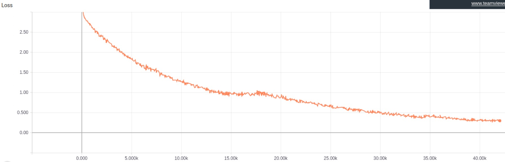
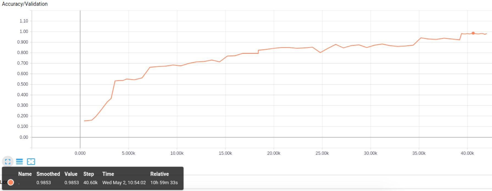
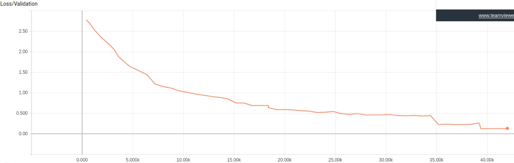
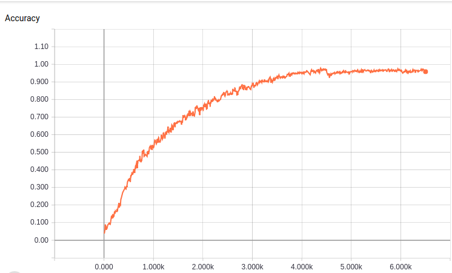
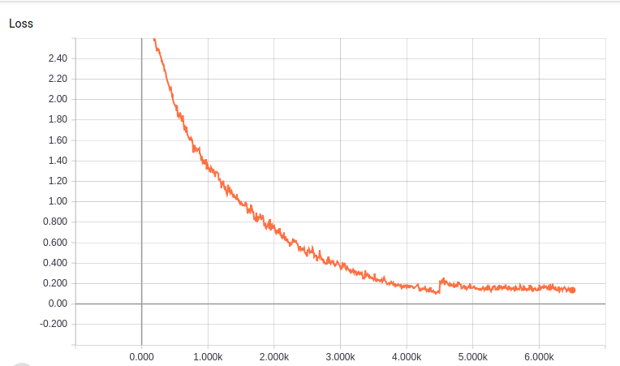
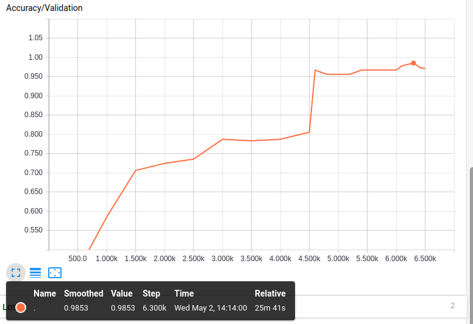
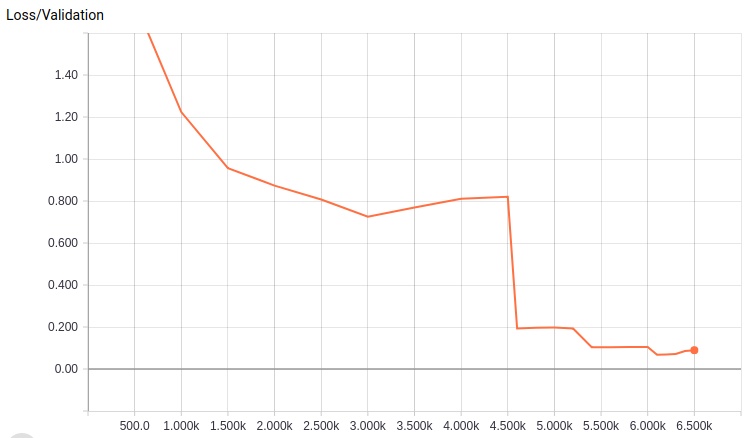
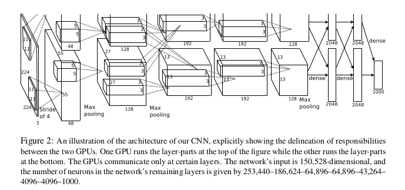

# Author: 1701214013 王尧

## 0. Result visualization

### SGD(Stochastic gradient descent)

- #### Accuracy on training set(converged around 0.92)



- #### Loss on training set



- #### Accuracy on validation set(converged around 0.98, peak: 0.9853)



- #### Loss on validation set



### momentum

- #### Accuracy on training set(converged around 0.92)



- #### Loss on training set



- #### Accuracy on validation set(converged around 0.98, peak: 0.9853)



- #### Loss on validation set



## 1. Network structure

- #### Main structure of AlexNet



- #### The building of Alexnet is sequential (by tflearn toolkit):

```
network = input_data(shape=[None, 227, 227, 3])
network = conv_2d(network, 96, 11, strides=4, activation='relu')
network = max_pool_2d(network, 3, strides=2)
network = local_response_normalization(network)
network = conv_2d(network, 256, 5, activation='relu')
network = max_pool_2d(network, 3, strides=2)
network = local_response_normalization(network)
network = conv_2d(network, 384, 3, activation='relu')
network = conv_2d(network, 384, 3, activation='relu')
network = conv_2d(network, 256, 3, activation='relu')
network = max_pool_2d(network, 3, strides=2)
network = local_response_normalization(network)
network = fully_connected(network, 4096, activation='tanh')
network = dropout(network, 0.2)
network = fully_connected(network, 4096, activation='tanh')
network = dropout(network, 0.2)
network = fully_connected(network, 17, activation='softmax')
```

- #### Here's hyperparameters of my Network.

|hyperparameters|     value     |
|---------------|---------------|
| learning_rate | 1e-3 ->> 2e-4 |
| optimizer     |  SGD/momentum |
| n_epoch       |  2000         |
| batch_size    |  64           |
| dropout_rate  |  0.2          |

## 2. Result analysis

|value|     SGD     |   momentum    |
|---|---------------|---------------|
|best val_acc| 0.9853 |  0.9853 |
|n_step to reach best val_acc| 40600 |  6200 |

- The SGD optimizer needs a big learning_rate like 1e-3. It is tend to stuck in local minimum when the learning_rate is set to 1e-5.
- fine tuning is needed for both SGD and momentum.
- For SGD, Total epoch number = n_step * batch_size / dataset_sum = 40600 * 64 / 1360 = 1966. For momentum, Total epoch number = n_step * batch_size / dataset_sum = 6200 * 64 / 1360 = 292. Momentum can find the way to the best model in a much quicker way.

## 3. References

[AlexNet Paper](http://papers.nips.cc/paper/4824-imagenet-classification-with-deep-convolutional-neural-networks.pdf)

[Flower Dataset (17)](http://www.robots.ox.ac.uk/~vgg/data/flowers/17/)

[morvan Tensorflow tutorial](https://morvanzhou.github.io/tutorials/machine-learning/tensorflow/5-16-transfer-learning/)

[ligechina/Deep_Learning_Course](https://github.com/ligechina/Deep_Learning_Course)

[zhihu Tflearn tutorial](https://zhuanlan.zhihu.com/p/25322066)
