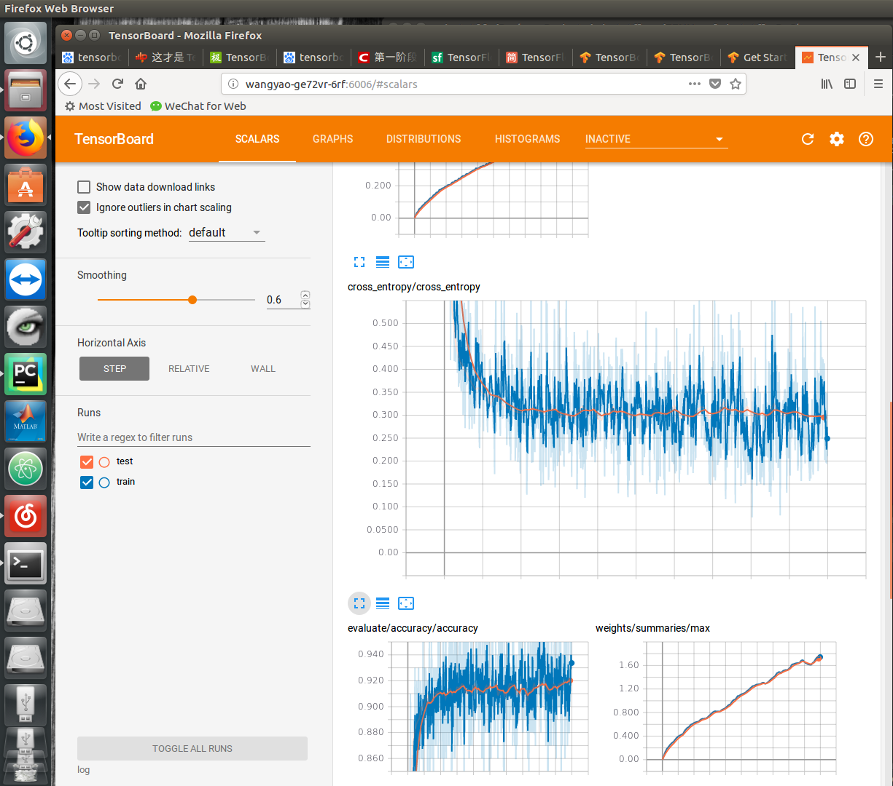
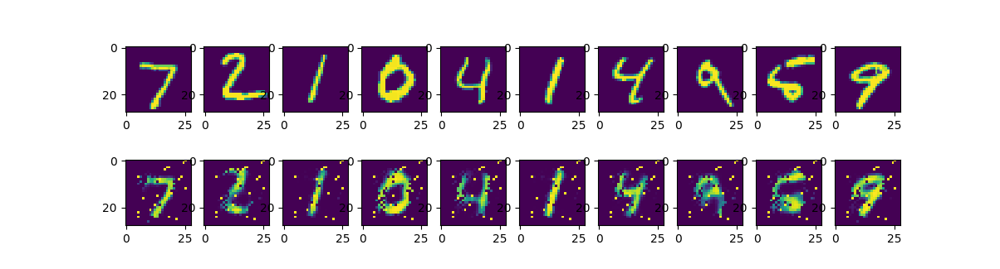

# Author: 1701214013 王尧
# part I. Loss visualization
## 0. network structure

- [Here's the 1-layer classification neural network constructed by tensorflow](FFNN.py)

```
with tf.name_scope('weights'):
        W = tf.Variable(tf.zeros([784, 10]))
        variable_summaries(W)
    with tf.name_scope('biases'):
        b = tf.Variable(tf.zeros([10]))
        variable_summaries(b)
    with tf.name_scope('Wx_plus_b'):
        V = tf.matmul(x, W) + b
        tf.summary.histogram('pre_activations', V)
    with tf.name_scope('softmax'):
        y = tf.nn.softmax(V)
        tf.summary.histogram('activations', y)
```



# part II. Hyperparameters Ablation Study
## 0. Network structure

- [Here's the 2-layer classification neural network constructed by keras](train.py)
```
model = Sequential()
model.add(Dense(input_dim=28*28,units=500)) # input_layer，28*28=784
model.add(Activation('sigmoid')) # activation function:sigmoid/tanh/relu, sigmoid seems better
model.add(Dropout(0.3))
model.add(Dense(units=500)) # 500
model.add(Activation('sigmoid'))
model.add(Dropout(0.3))
model.add(Dense(units=10)) # 10 classes, so the output unit number is 10
model.add(Activation('softmax')) # softmax as the last layer of classification
```

- some hyperparameters
```
sgd = SGD(lr=0.01, decay=1e-6, momentum=0.9, nesterov=True) # set hyperparameters
```

- use categorical_crossentropy as loss function:
```
model.compile(loss='categorical_crossentropy', optimizer=sgd) # set categorical_crossentropy as loss function
```

## 1. Ablation studies

### 1.1 Activation unit

|activation|dropout|epoch|batch_size|loss_avg|val_loss_avg|
|----------|-------|-----|----------|--------|------------|
| sigmoid  |   0   | 100 |    200   | 0.0959 |   0.1497   |
|   tanh   |   0   | 100 |    200   | 0.1723 |   0.2039   |
|   relu   |   0   | 100 |    200   | 14.4564|  14.3854   |
|   tanh   |  0.2  | 100 |    200   | 0.1933 |   0.1410   |
|   relu   |  0.2  | 100 |    200   | 14.2764|  14.3782   |
| sigmoid  |  0.5  | 100 |    200   | 0.1650 |   0.1234   |
|   tanh   |  0.5  | 100 |    200   | 0.3371 |   0.2015   |
|   relu   |  0.5  | 100 |    200   | 14.5677|  14.4964   |

### 1.2 Dropout rate

|activation|dropout|epoch|batch_size|loss_avg|val_loss_avg|
|----------|-------|-----|----------|--------|------------|
| sigmoid  |   0   | 100 |    200   | 0.0959 |   0.1497   |
| sigmoid  |  0.1  | 100 |    200   | 0.1017 |   0.1219   |
| sigmoid  |  0.2  | 100 |    200   | 0.1101 |   0.1149   |
| sigmoid  |  0.3  | 100 |    200   | 0.1197 |   0.1176   |
| sigmoid  |  0.4  | 100 |    200   | 0.1017 |   0.1219   |
| sigmoid  |  0.5  | 100 |    200   | 0.1650 |   0.1234   |

### 1.2 Epoch number

|activation|dropout|epoch|batch_size|loss_avg|val_loss_avg|
|----------|-------|-----|----------|--------|------------|
| sigmoid  |  0.2  | 100 |    200   | 0.1101 |   0.1149   |
| sigmoid  |  0.2  | 200 |    200   | 0.0838 |   0.0988   |
| sigmoid  |  0.2  | 300 |    200   | 0.0609 |   0.0942   |
| sigmoid  |  0.2  | 500 |    200   | 0.0387 |   0.0861   |

|activation|dropout|epoch|batch_size|loss_avg|val_loss_avg|
|----------|-------|-----|----------|--------|------------|
| sigmoid  |  0.2  | 100 |    400   | 0.0696 |   0.1019   |
| sigmoid  |  0.2  | 200 |    400   | 0.0448 |   0.0948   |
| sigmoid  |  0.2  | 300 |    400   | 0.0341 |   0.0933   |
| sigmoid  |  0.2  | 500 |    400   | 0.0205 |   0.0944   |
| sigmoid  |  0.2  |1000 |    400   | 0.0108 |   0.1015   |


### 1.3 Batch size

|activation|dropout|epoch|batch_size|loss_avg|val_loss_avg|
|----------|-------|-----|----------|--------|------------|
| sigmoid  |  0.2  | 100 |    200   | 0.1101 |   0.1149   |
| sigmoid  |  0.2  | 100 |    400   | 0.0696 |   0.1019   |
| sigmoid  |  0.2  | 100 |    600   | 0.0503 |   0.1089   |
| sigmoid  |  0.2  | 100 |    800   | 0.0477 |   0.1234   |
| sigmoid  |  0.2  | 100 |   1000   | 0.0559 |   0.1446   |


## 2. Result analysis

We could see that dropout = 0.2, batch_size = 400 and sigmoid activation function fit best for this 2-layer cnn.
The bigger epoch is, the lower loss in train set. However, epoch number over 300 leads to a increasing loss in validation set, which means **overfitting**.



## 3. References

[morvan Tensorflow tutorial](https://morvanzhou.github.io/tutorials/machine-learning/tensorflow/5-16-transfer-learning/)

[ligechina/Deep_Learning_Course](https://github.com/ligechina/Deep_Learning_Course)
